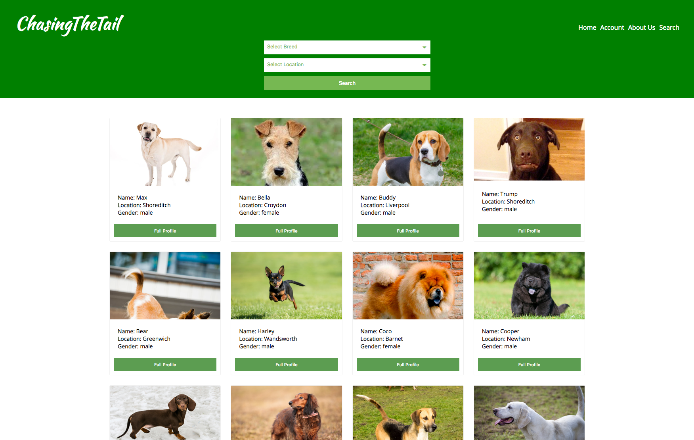

# Chasing the Tail

## Technologies used:

- Javascript
- TDD
- CSS flex
- Sass
- React and Redux
- Express

## Web Application for dog owners to meet each other.
---

---

## Constructor Wars App is available soon as Rafal is back from Mexico.

### To start the frontend:- `npm run start`

### To start the backend:- `npm run dev:w`

--

## Contribution guide:

swap to master
then git pull
thenn swap to working branch
then git merge origin master
then see if there are any conflicts and fix them
then push to git push --set-upstream origin......
then look on github and to a pull request
